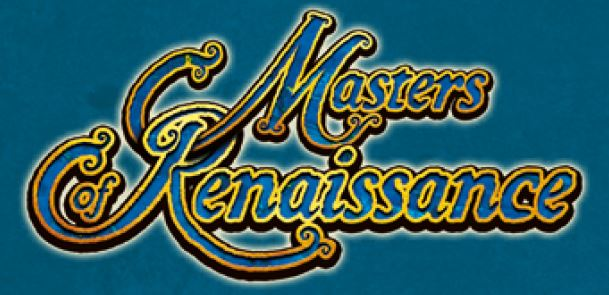

# Prova Finale Ingegneria del Software 2021

 - ### Luca Favaro ([**@lucafavaro1**](https://github.com/lucafavaro1))	 luca1.favaro@mail.polimi.it
 - ### Emilio Corigliano ([**@EmilioCorigliano**](https://github.com/EmilioCorigliano))   emilio.corigliano@mail.polimi.it
 - ### Gianmarco Frangipane ([**@giamma-frangipane**](https://github.com/giamma-frangipane))   gianmarco.frangipane@mail.polimi.it
	
## Implemented Functionalities
| Functionality | Status |
|:-----------------------|:------------------------------------:|
| Basic rules |  |
| Complete rules | |
| Socket | |
| GUI |  |
| CLI | |
| Multiple Games | |
| Disconnection Resilience | |

<!--

-->

# Maestri del Rinascimento

## Overview

This project implements the complete rules of the game [Maestri del Rinascimento](http://www.craniocreations.it/prodotto/masters-of-renaissance/ "Buy the Game")
with both a Command Line Interface and a Graphical User Interface, using sockets for client-server communication.

The [deliverables](/deliverables) folder contains the initial model UML and three Sequence Diagrams illustrating how the client and the server communicate in various scenarios.

The [src](/src) folder contains source code and unit tests.

## Setup

<!--
Da completare con 
-->
 
 

## Build

<!--
Da completare 
-->

## Tools
 
 * [draw.io](https://app.diagrams.net/) - Model UML 
 * [UMLet](https://www.umlet.com/) -  Sequence Diagrams
 * [Maven](https://maven.apache.org/) - Dependency Management
 * [IntelliJ 2021](https://www.jetbrains.com/idea/) - IDE
 * [JavaFX](https://openjfx.io) - Graphical Framework
 * [SceneBuilder](https://gluonhq.com/products/scene-builder/) - Visual Layout Tool 
 
## Requirements
The game requires Java 8 or later in order to run correctly.
 
 ## License
 
 This project is developed in collaboration with [Politecnico di Milano](https://www.polimi.it) and [Cranio Creations](http://www.craniocreations.it).
 
<!--

-->

